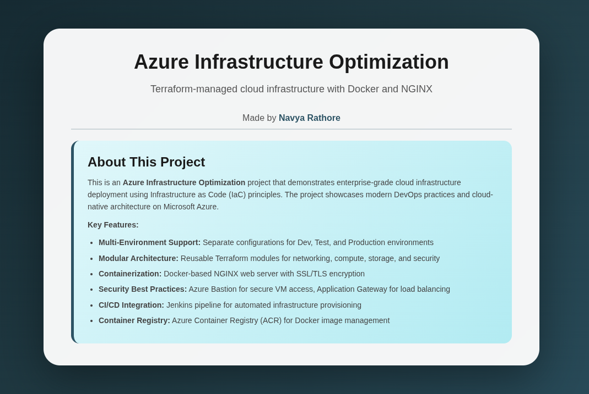

# Azure Terraform Infrastructure - NGINX Deployment




**Enterprise-grade Infrastructure as Code (IaC) solution for deploying secure, highly available NGINX web applications on Microsoft Azure using Terraform, with complete CI/CD automation.**

---

## Table of Contents

- [Overview](#overview)
- [Architecture](#architecture)
- [Key Features](#key-features)
- [Project Structure](#project-structure)
- [Prerequisites](#prerequisites)
- [Getting Started](#getting-started)
- [Configuration Reference](#configuration-reference)
- [Terraform Modules](#terraform-modules)
- [CI/CD Pipelines](#cicd-pipelines)
- [Troubleshooting](#troubleshooting)
---

## Overview

This project provides a **production-ready, modular Terraform infrastructure** for deploying containerized NGINX web applications on Azure. It demonstrates modern DevOps practices including Infrastructure as Code, containerization, secure networking, and automated CI/CD pipelines.

### What This Infrastructure Does

1. **Creates a secure multi-tier Azure network** with public, private, and Application Gateway subnets
2. **Deploys Ubuntu VMs in a private subnet** with no direct internet access
3. **Automatically provisions Docker and NGINX** containers using cloud-init
4. **Configures Application Gateway** with SSL/TLS termination and load balancing
5. **Provides secure access** through a bastion jump server
6. **Stores Docker images** in Azure Container Registry
7. **Manages infrastructure state** remotely in Azure Storage
8. **Automates deployments** with Jenkins and Azure DevOps pipelines

---

## Architecture

### Network Architecture Diagram

```
Internet (HTTPS)
       ↓
┌──────────────────────────────────────────────────────────────────┐
│                   Azure Virtual Network (10.0.0.0/16)             │
├──────────────────────────────────────────────────────────────────┤
│                                                                    │
│  ┌─────────────────┐  ┌──────────────────┐  ┌─────────────────┐ │
│  │ Public Subnet   │  │ Private Subnet   │  │ AppGW Subnet    │ │
│  │ (10.0.1.0/24)   │  │ (10.0.2.0/24)    │  │ (10.0.3.0/24)   │ │
│  │                 │  │                  │  │                 │ │
│  │ ┌─────────────┐ │  │ ┌──────────────┐│  │ ┌─────────────┐ │ │
│  │ │   Bastion   │ │  │ │  NGINX VMs   ││  │ │ Application │ │ │
│  │ │    Host     │─┼──┼▶│  (Docker)    ││◀─┼─│   Gateway   │ │ │
│  │ │  (SSH Key)  │ │  │ │              ││  │ │ (SSL Term)  │ │ │
│  │ └─────────────┘ │  │ │ Cloud-init:  ││  │ └─────────────┘ │ │
│  │     Public IP   │  │ │ - Docker     ││  │     Public IP   │ │
│  └─────────────────┘  │ │ - ACR Login  ││  └─────────────────┘ │
│                       │ │ - Pull Image ││                       │
│                       │ │ - Systemd    ││                       │
│                       │ └──────────────┘│                       │
│                       │        ↓         │                       │
│                       │   NAT Gateway    │                       │
│                       │   (Static IP)    │                       │
│                       └──────────────────┘                       │
│                              ↓                                    │
└──────────────────────────────┼────────────────────────────────────┘
                               ↓
                  ┌─────────────────────────┐
                  │  Azure Container        │
                  │  Registry (ACR)         │
                  │  nginx-https:latest     │
                  └─────────────────────────┘
```

### Traffic Flow

1. **User HTTPS Request** → Application Gateway Public IP (443)
2. **SSL/TLS Termination** → Application Gateway decrypts traffic
3. **Load Balancing** → Distributes to backend VM pool (HTTP or HTTPS)
4. **Health Monitoring** → Continuous health checks on `/` endpoint
5. **Container Response** → NGINX container serves request
6. **Outbound Traffic** → VMs use NAT Gateway for internet access (ACR, updates)

### Infrastructure Components

| Component | Type | Purpose | Configuration |
|-----------|------|---------|---------------|
| **Virtual Network** | Network | Network isolation | 10.0.0.0/16 |
| **Public Subnet** | Network | Bastion host | 10.0.1.0/24 |
| **Private Subnet** | Network | Application VMs | 10.0.2.0/24 |
| **AppGW Subnet** | Network | Application Gateway | 10.0.3.0/24 |
| **NAT Gateway** | Network | Outbound internet | Static Public IP |
| **Application Gateway** | Load Balancer | L7 LB + SSL | Standard_v2 |
| **Bastion Host** | Compute | SSH Jump Server | Ubuntu 22.04 LTS |
| **Application VMs** | Compute | NGINX Containers | Ubuntu 22.04 LTS + Docker |
| **Azure Container Registry** | Container | Docker Registry | Standard tier |
| **Network Security Groups** | Security | Firewall Rules | SSH, HTTP, HTTPS |
| **Storage Account** | State | Terraform State | Blob Storage + Versioning |

---

## Key Features

### Infrastructure Features

- **Private Network Architecture** - Application VMs in private subnet with no public IPs  
- **Bastion Host Access** - Secure SSH jump server with key-based authentication  
- **NAT Gateway** - Outbound internet for OS updates and ACR access  
- **Network Security Groups** - Granular firewall rules at subnet and NIC level  
- **Application Gateway** - Layer 7 load balancer with SSL/TLS termination  
- **Self-Signed SSL Certificates** - Automatically generated using Terraform  
- **Health Probes** - Continuous backend health monitoring  

### Container & Deployment Features

- **Docker Containerization** - NGINX packaged as Alpine-based image  
- **Azure Container Registry** - Private registry with admin access  
- **Cloud-init Provisioning** - Automated VM configuration  
- **Systemd Integration** - Containers managed as system services  
- **Automatic ACR Authentication** - VMs auto-login and pull images  
- **Multi-stage Dockerfile** - Optimized image build  

### Operational Features

- **Multi-Environment Support** - Separate dev, test, and prod configurations  
- **Remote State Management** - Terraform state in Azure Storage with versioning  
- **Modular Design** - Reusable modules for all components  
- **CI/CD Ready** - Jenkins and Azure DevOps pipelines  
- **Infrastructure as Code** - 100% Terraform, no manual steps

---

## Project Structure

```
azure_terraform_infrastructure_optimization/
│
├── environments/                  
│   ├── dev/                      
│   │   ├── backend.tf             
│   │   ├── locals.tf             
│   │   ├── main.tf              
│   │   ├── variables.tf           
│   │   └── outputs.tf           
│   ├── test/                      
│   └── prod/                      
│
├── modules/                         
│   ├── networkin/
│   ├── bastion/
│   ├── compute/
│   ├── app-gateway/
│   └── acr/
│
├── docker/nginx/                   
│   ├── Dockerfile                  
│   ├── nginx.conf                  
│   ├── index.html                  
│   ├── docker-compose.yml          
│   └── scripts/
│       └── generate-ssl.sh         
│
├── ci-cd/                           
│   ├── azure-pipelines/
│   │   ├── azure-pipelines.yml    
│   │   └── templates/             
│   │       ├── terraform-setup.yml
│   │       ├── terraform-plan.yml
│   │       ├── terraform-apply.yml
│   │       ├── docker-build.yml
│   │       └── health-check.yml
│   └── jenkins/
│       └── Jenkinsfile            
│
├── scripts/                         
│   ├── bootstrap-backend.sh      
│   └── build-and-push-docker.sh   
│
├── assets/                         
│   └── webpage.png
│
└── README.md
```

---

## Prerequisites

**Required Tools:**
- [Azure CLI](https://docs.microsoft.com/en-us/cli/azure/install-azure-cli) 2.50+
- [Terraform](https://www.terraform.io/downloads) 1.5.0+
- [Docker](https://docs.docker.com/get-docker/) 20.10+
- Git 2.30+

**Azure Requirements:**
- Active Azure subscription with Contributor or Owner access
- Sufficient quota for 2-4 vCPUs and 3 public IPs

---

## Getting Started

### 1. Clone and Setup

```bash
# Clone repository
git clone https://github.com/yourusername/azure_terraform_infrastructure_optimization.git
cd azure_terraform_infrastructure_optimization
chmod +x scripts/*.sh

# Login to Azure
az login

# Set subscription (if you have multiple)
az account set --subscription "<subscription-id>"
```

### 2. Bootstrap Terraform Backend

Create Azure Storage for Terraform state:

```bash
./scripts/bootstrap-backend.sh
```

This creates a resource group, storage account, and blob container with versioning enabled.

### 3. Generate SSH Key

```bash
ssh-keygen -t rsa -b 4096 -C "azure-bastion" -f ~/.ssh/azure_bastion
```

### 4. Configure Variables

Edit the configuration for your environment:

```bash
cd environments/dev
nano terraform.tfvars
```

**Required variables:**

```hcl
# VM administrator password (12-72 chars, mixed case, number, special char)
admin_password = "YourSecureP@ssw0rd123!"

# SSH public key from step 3
ssh_public_key = "ssh-rsa AAAAB3NzaC1yc2EAAAADAQABAAACAQ..."

# Your public IP for SSH access (find it: curl ifconfig.me)
allowed_ssh_cidr = "203.0.113.42/32"

# SSL certificate password
ssl_certificate_password = "YourSSLCertP@ss!"
```

### 5. Deploy Infrastructure

```bash
# Initialize Terraform
terraform init

# Preview changes
terraform plan

# Deploy (takes ~15-20 minutes)
terraform apply
```

### 6. Build and Push Docker Image

```bash
# Return to project root
cd ../..

# Build and push using the provided script
./scripts/build-and-push-docker.sh dev
```

### 7. Access Your Application

```bash
cd environments/dev
APP_IP=$(terraform output -raw app_gateway_public_ip)
echo "Application URL: https://$APP_IP"
```

Open the URL in your browser and accept the self-signed certificate warning.

### Multi-Environment Deployment

Deploy to test or production:

```bash
# Test environment
cd environments/test
terraform init && terraform apply

# Production (always review plan first)
cd environments/prod
terraform init
terraform plan -out=prod.tfplan
terraform apply prod.tfplan
```

### Custom Domain Setup (Optional)

1. Update `terraform.tfvars`:
   ```hcl
   ssl_certificate_common_name = "app.yourdomain.com"
   ```

2. Deploy infrastructure:
   ```bash
   terraform apply
   ```

3. Create DNS A record pointing `app.yourdomain.com` to the Application Gateway IP

4. For production, replace self-signed certificate with a CA-issued certificate

### SSH Access to Infrastructure (Optional)

```bash
# Get IPs
BASTION_IP=$(terraform output -raw bastion_public_ip)
VM_IP=$(terraform output -json vm_private_ips | jq -r '.[0]')

# SSH to bastion
ssh -i ~/.ssh/azure_bastion azureuser@$BASTION_IP

# From bastion, access private VM
ssh azureuser@$VM_IP

# Check Docker container status
sudo docker ps
sudo systemctl status nginx-container
```

---

## Configuration Reference

### Complete Variable Reference

#### Security Configuration

```hcl
# VM administrator password (Azure complexity requirements: 12-72 chars)
admin_password = "SecureP@ssw0rd123!"

# SSH public key for bastion host access
ssh_public_key = "ssh-rsa AAAAB3NzaC1yc2EAAAADAQABAAACAQ..."

# CIDR block allowed to SSH to bastion (your public IP)
allowed_ssh_cidr = "203.0.113.42/32"

# SSL certificate password
ssl_certificate_password = "SSLCertP@ss!"

# SSL certificate common name
ssl_certificate_common_name = "webapp-dev.local"
```

#### Network Configuration

```hcl
# Virtual network address space
vnet_address_space = "10.0.0.0/16"

# Public subnet (bastion host)
public_subnet_cidr = "10.0.1.0/24"

# Private subnet (application VMs)
private_subnet_cidr = "10.0.2.0/24"

# Application Gateway dedicated subnet
appgw_subnet_cidr = "10.0.3.0/24"
```

#### Compute Configuration

```hcl
# VM SKU (B-series for cost, D-series for production)
vm_sku = "Standard_B2ms"  # 2 vCPU, 8GB RAM

# Number of VM instances
instance_count = 2

# Availability zone (optional, comment out for better regional support)
# availability_zone = "1"

# VM administrator username
admin_username = "azureuser"
```

#### Application Gateway Configuration

```hcl
# Application Gateway SKU
app_gateway_sku_name = "Standard_v2"
app_gateway_sku_tier = "Standard_v2"

# Number of App Gateway instances
app_gateway_capacity = 2
```

#### Container Registry Configuration

```hcl
# ACR SKU (Basic, Standard, or Premium)
acr_sku = "Standard"

# Docker image configuration
docker_image_name = "nginx-https"
docker_image_tag  = "latest"
```

#### Project Configuration

```hcl
# Project name (used in resource naming)
project_name = "webapp"

# Azure region for deployment
location = "eastasia"  # Options: eastus, westeurope, etc.
```

---

## Terraform Modules

### Networking Module (`modules/networking/`)

Creates the foundation network infrastructure with security-first design.

**Resources:**
- Virtual Network with three subnets (public, private, App Gateway)
- NAT Gateway with static public IP for outbound internet access
- Network Security Groups with subnet associations
- Public IP for Application Gateway

**Security:** Bastion SSH access restricted by IP allowlist, private VMs isolated from internet inbound traffic, NAT Gateway for controlled outbound access.

**Key Outputs:** `vnet_id`, `public_subnet_id`, `private_subnet_id`, `appgw_subnet_id`, `app_gateway_public_ip_id`

### Compute Module (`modules/compute/`)

Deploys application VMs with automated Docker and NGINX container setup.

**Resources:**
- Linux VMs (Ubuntu 22.04 LTS) with network interfaces
- Application Gateway backend pool associations
- Cloud-init configuration for automated provisioning

**Automation:** Installs Docker CE, authenticates with ACR, pulls NGINX image, creates systemd service for container management, and enables auto-start on boot.

**Key Outputs:** `vm_ids`, `vm_names`, `vm_private_ips`

### Application Gateway Module (`modules/app-gateway/`)

Deploys Layer 7 load balancer with SSL/TLS termination.

**Resources:**
- Application Gateway (Standard_v2)
- Self-signed SSL certificate (auto-generated)
- Frontend IP, backend pool, listeners, and routing rules
- Health probes for backend monitoring

**Features:** SSL termination at gateway level, HTTP to HTTPS redirect, continuous health monitoring, and load balancing across backend VMs.

**Key Outputs:** `app_gateway_id`, `app_gateway_public_ip`, `backend_address_pool_id`

### ACR Module (`modules/acr/`)

Deploys private Docker registry for container images.

**Resources:**
- Azure Container Registry (Standard SKU)
- Admin user credentials for authentication

**Configuration:** Supports webhooks and geo-replication, admin access enabled for VM authentication, HTTPS-only enforced.

**Key Outputs:** `acr_name`, `acr_login_server`, `acr_admin_username`, `acr_admin_password`

### Bastion Module (`modules/bastion/`)

Deploys secure jump server for SSH access to private infrastructure.

**Resources:**
- Linux VM (Ubuntu 22.04 LTS) with public IP
- Network Interface and Security Group with SSH rules

**Security:** SSH key-based authentication only, IP allowlist for access control, outbound internet enabled, SSH access to private subnet allowed.

**Key Outputs:** `bastion_public_ip`, `bastion_vm_id`

---

## CI/CD Pipelines

This project includes production-ready CI/CD implementations for both Jenkins and Azure DevOps.

### Jenkins Pipeline

**File:** `ci-cd/jenkins/Jenkinsfile`

Declarative Jenkins pipeline with approval gates and Docker integration.

#### Pipeline Stages

1. **Setup** - Azure CLI authentication
2. **Terraform Init** - Initialize working directory
3. **Terraform Plan** - Generate execution plan
4. **Terraform Apply** - Deploy infrastructure (with approval)
5. **Terraform Destroy** - Remove resources (with approval)
6. **Docker Build & Push** - Build and push to ACR

#### Quick Setup

**Setup:**

**1. Required Plugins:**
- Azure CLI Plugin
- Pipeline Plugin
- Docker Pipeline Plugin
- Git Plugin

**2. Configure Credentials:**

Create Azure Service Principal:
```bash
az ad sp create-for-rbac \
  --name "terraform-sp" \
  --role="Contributor" \
  --scopes="/subscriptions/YOUR_SUBSCRIPTION_ID"
```

Add to Jenkins credentials:
- `azure-subscription-id`
- `azure-client-id`
- `azure-client-secret`
- `azure-tenant-id`

**3. Create Pipeline Job:**
- New Item → Pipeline
- Pipeline from SCM: Git
- Script Path: `Jenkinsfile`

**Pipeline Parameters:**
- **ENVIRONMENT**: dev, test, or prod
- **ACTION**: plan, apply, or destroy
- **BUILD_DOCKER**: Build and push Docker image
- **AUTO_APPROVE**: Skip manual approval (use with caution)

**Running:**
1. Build with Parameters
2. Select environment and action
3. Approve when prompted (for apply/destroy)

---

### Azure DevOps Pipeline

Multi-stage YAML pipeline with modular templates for clean, maintainable CI/CD.

**Features:**
- Template-based architecture (5 reusable templates)
- Multi-environment support (dev, test, prod)
- Terraform validation, plan, and apply workflows
- Docker build and push to Azure Container Registry
- Post-deployment health checks
- Automatic approval gates for production and destroy

**Pipeline Stages:**
1. **Plan** - Validates and creates Terraform plan
2. **Apply** - Deploys infrastructure (requires approval in prod)
3. **Docker** - Builds and pushes image to ACR
4. **Destroy** - Removes resources (requires approval)
5. **Validate** - Health checks and verification

---

#### Setup (20 minutes)

**Prerequisites:**
- Azure subscription
- Azure DevOps organization and project
- Admin access to create service connections

**1. Create Service Principal**

```bash
az ad sp create-for-rbac \
  --name "azdo-terraform-sp" \
  --role Contributor \
  --scopes /subscriptions/<YOUR_SUBSCRIPTION_ID>
```

Save the output (`appId`, `password`, `tenant`).

**2. Create Service Connection**

1. Go to **Project Settings** → **Service connections**
2. Create **Azure Resource Manager** connection (manual)
3. Name: `Azure-Service-Connection`
4. Fill in details from Step 1
5. Click **Verify and save**

**3. Create Variable Groups**

Create these in **Pipelines** → **Library**:

- **dev-vars:** `admin_password` (secret), `environment` = `dev`
- **test-vars:** `admin_password` (secret), `environment` = `test`
- **prod-vars:** `admin_password` (secret), `environment` = `prod`

**4. Create Pipeline**

1. **Pipelines** → **New pipeline**
2. Select your repository
3. Choose **Existing Azure Pipelines YAML file**
4. Select `/azure-pipelines.yml`
5. **Save and run**

---

#### Usage

**Run the Pipeline:**

Click **Run pipeline** and configure:
- **Environment**: `dev`, `test`, or `prod`
- **Action**: `plan`, `apply`, or `destroy`
- **Build Docker**: Check to build and push Docker image

---

#### Troubleshooting

- **Service connection not found**: Verify name matches in `azure-pipelines.yml`
- **Variable group not found**: Check Pipelines → Library, grant pipeline permissions
- **Terraform init failed**: Ensure backend storage account exists and is accessible
- **Cannot download plan artifact**: Run with `action=plan` first, then `action=apply`

---

## Acknowledgments

- Azure Terraform Modules Community
- HashiCorp Terraform Documentation
- Azure Architecture Center
- NGINX Documentation

---

#### *Made by: Navya Rathore*

#### *Last Updated: October 9, 2025*  
