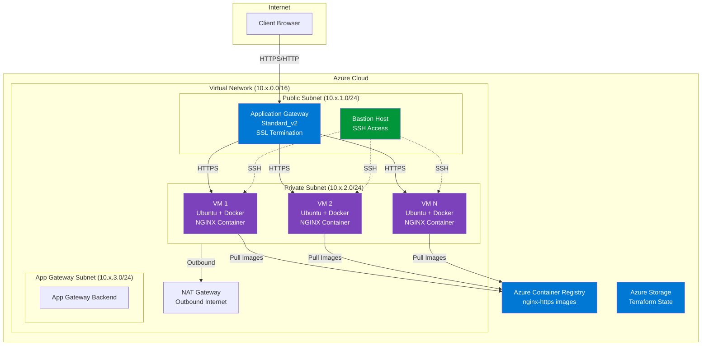

# Azure Terraform Infrastructure - NGINX Deployment


Modular Terraform infrastructure on Azure for deploying Dockerized NGINX with HTTPS, load balancing, and Jenkins CI/CD.

---

## Table of Contents

- [Overview](#overview)
- [Architecture](#architecture)
- [Project Structure](#project-structure)
- [Prerequisites](#prerequisites)
- [Quick Start](#quick-start)
- [Configuration](#configuration)
- [Modules](#modules)
- [Jenkins CI/CD](#jenkins-cicd)

---

## Overview

Infrastructure as Code (IaC) solution for deploying secure, scalable web applications on Azure using Terraform.

**Key Features:**
- Multi-environment support (dev, test, prod)
- HTTPS encryption with SSL/TLS termination
- Private network deployment with bastion access
- Application Gateway with Layer 7 load balancing
- Azure Container Registry integration
- Jenkins CI/CD pipeline

---

## Architecture



### Infrastructure Components

**Network Layer:**
- Virtual Network with public (10.x.1.0/24) and private (10.x.2.0/24) subnets
- Application Gateway subnet (10.x.3.0/24)
- NAT Gateway for private VM outbound access
- Network Security Groups with restrictive firewall rules

**Compute Layer:**
- VM Availability Set (configurable VM count per environment)
- Ubuntu 22.04 LTS with Docker pre-installed
- Cloud-init automated provisioning
- NGINX containers from Azure Container Registry

**Load Balancing & Security:**
- Application Gateway (Standard_v2) with SSL termination
- HTTP to HTTPS automatic redirection
- Health probes and session affinity

**Container Registry:**
- Azure Container Registry (Standard tier)
- Private Docker image hosting

**Management:**
- Bastion host for secure SSH access
- SSH key-based authentication
- Configurable IP allowlists

**State Management:**
- Azure Storage Account for remote Terraform state
- State locking enabled

---

## Project Structure

```
azure_terraform_infrastructure_optimization/
├── docker/nginx/             
│   ├── Dockerfile
│   ├── nginx.conf
│   ├── docker-compose.yml
│   ├── generate-ssl.sh
│   └── index.html
├── env/                       
│   ├── dev/
│   ├── test/
│   └── prod/
│       ├── backend.tf
│       ├── locals.tf
│       ├── main.tf
│       ├── variables.tf
│       ├── terraform.tfvars
│       └── outputs.tf
├── modules/                   
│   ├── networking/
│   ├── bastion/
│   ├── compute/
│   ├── app-gateway/
│   └── acr/
├── scripts/
│   ├── bootstrap-backend.sh
│   └── build-and-push-docker.sh
├── Jenkinsfile
└── README.md
```

---

## Prerequisites

**Required Tools:**
- Azure CLI (2.50+)
- Terraform (1.5+)
- Docker (for building images)

**Azure Requirements:**
- Active Azure subscription
- Permissions to create resources
- Service Principal (for CI/CD)

---

## Quick Start

### 1. Clone and Setup

```bash
git clone https://github.com/yourusername/azure_terraform_infrastructure_optimization.git
cd azure_terraform_infrastructure_optimization
chmod +x scripts/*.sh
```

### 2. Azure Login

```bash
az login
az account show
```

```bash
./scripts/bootstrap-backend.sh
```

Creates Azure Storage Account for Terraform state management.

### 4. Configure Environment

Edit configuration in `env/dev/terraform.tfvars`:

```bash
cd env/dev
nano terraform.tfvars
```

**Required Variables:**
```hcl
# VM admin password (12-72 chars, uppercase, lowercase, number, special char)
admin_password = "YourSecurePassword123!"

# SSH access for bastion
ssh_public_key   = "ssh-rsa AAAAB3NzaC1yc2E..."  # Generate: ssh-keygen -t rsa -b 4096
allowed_ssh_cidr = "YOUR_IP/32"  # Your public IP

# SSL certificate password
ssl_certificate_password = "YourSSLPassword123!"

# Project settings
project_name = "webapp"
location     = "eastasia"
```

### 5. Deploy Infrastructure

```bash
cd env/dev
terraform init
terraform plan
terraform apply
```

### 6. Build and Push Docker Image

```bash
./scripts/build-and-push-docker.sh dev
```

### 7. Access Application

```bash
APP_IP=$(terraform output -raw app_gateway_public_ip)
echo "https://$APP_IP"
```

Visit in browser (accept self-signed certificate warning).

---

## Configuration

### Key Variables (terraform.tfvars)

**Security:**
- `admin_password` - VM admin password
- `ssh_public_key` - SSH public key for bastion
- `allowed_ssh_cidr` - IP allowlist for SSH access
- `ssl_certificate_password` - SSL certificate password

**Network:**
- `vnet_address_space` - Virtual network CIDR (default: 10.0.0.0/16)
- `public_subnet_cidr` - Public subnet CIDR
- `private_subnet_cidr` - Private subnet CIDR
- `appgw_subnet_cidr` - Application Gateway subnet CIDR

**Compute:**
- `vm_sku` - VM size (e.g., Standard_B2ms)
- `instance_count` - Number of VMs
- `admin_username` - VM admin username

**Application Gateway:**
- `app_gateway_sku_name` - Gateway SKU (Standard_v2)
- `app_gateway_capacity` - Instance count

**Container Registry:**
- `acr_sku` - ACR tier (Standard)
- `docker_image_name` - Docker image name
- `docker_image_tag` - Image tag

---

## Modules

### Networking Module (`modules/networking/`)

**Creates:**
- Virtual Network
- Public, private, and Application Gateway subnets
- NAT Gateway
- Network Security Groups

**Key Outputs:**
- `vnet_id`
- `public_subnet_id`
- `private_subnet_id`
- `app_gateway_public_ip_id`

### Compute Module (`modules/compute/`)

**Creates:**
- VM Availability Set
- Linux VMs (Ubuntu 22.04 LTS)
- Network Interfaces
- Cloud-init provisioning with Docker

**Key Outputs:**
- `vm_ids`
- `vm_names`
- `vm_private_ips`

### Application Gateway Module (`modules/app-gateway/`)

**Creates:**
- Application Gateway (Standard_v2)
- SSL certificate configuration
- HTTP/HTTPS listeners
- Backend pools and routing rules
- Health probes

**Features:**
- SSL termination
- HTTP to HTTPS redirect
- Session affinity

**Key Outputs:**
- `app_gateway_id`
- `app_gateway_public_ip`
- `backend_address_pool_id`

### ACR Module (`modules/acr/`)

**Creates:**
- Azure Container Registry (Standard tier)
- Admin access credentials

**Key Outputs:**
- `acr_name`
- `acr_login_server`
- `acr_admin_username`
- `acr_admin_password`

### Bastion Module (`modules/bastion/`)

**Creates:**
- Bastion host VM
- Public IP
- SSH key configuration

---

## Jenkins CI/CD

### Setup

**1. Required Plugins:**
- Azure CLI Plugin
- Pipeline Plugin
- Docker Pipeline Plugin
- Git Plugin

**2. Configure Credentials:**

Create Azure Service Principal:
```bash
az ad sp create-for-rbac \
  --name "terraform-sp" \
  --role="Contributor" \
  --scopes="/subscriptions/YOUR_SUBSCRIPTION_ID"
```

Add to Jenkins credentials:
- `azure-subscription-id`
- `azure-client-id`
- `azure-client-secret`
- `azure-tenant-id`

**3. Create Pipeline Job:**
- New Item → Pipeline
- Pipeline from SCM: Git
- Script Path: `Jenkinsfile`

### Pipeline Parameters

- **ENVIRONMENT**: dev, test, or prod
- **ACTION**: plan, apply, or destroy
- **BUILD_DOCKER**: Build and push Docker image
- **AUTO_APPROVE**: Skip manual approval (use with caution)

### Running

1. Build with Parameters
2. Select environment and action
3. Approve when prompted (for apply/destroy)

---

*Last Updated: October 8, 2025*  
