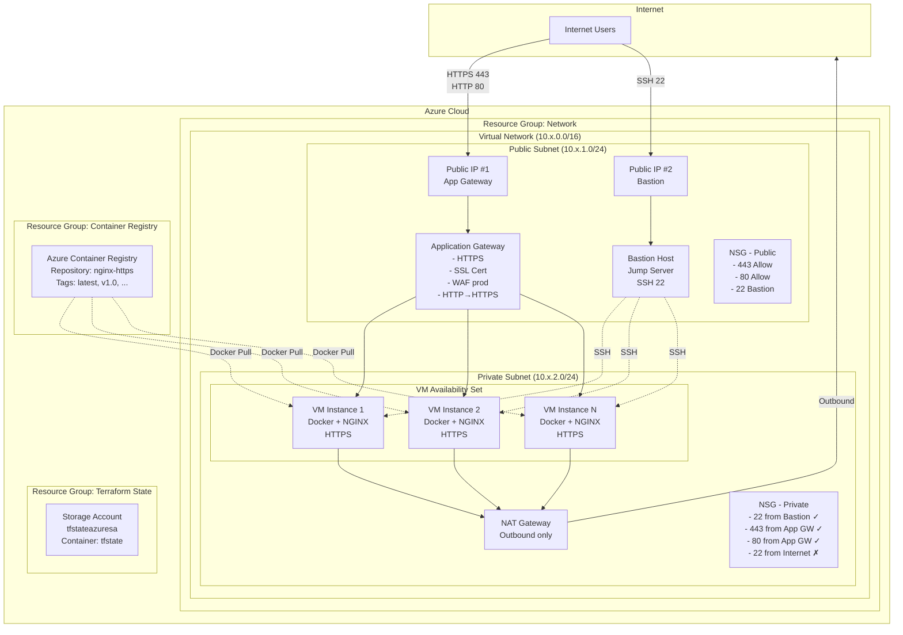
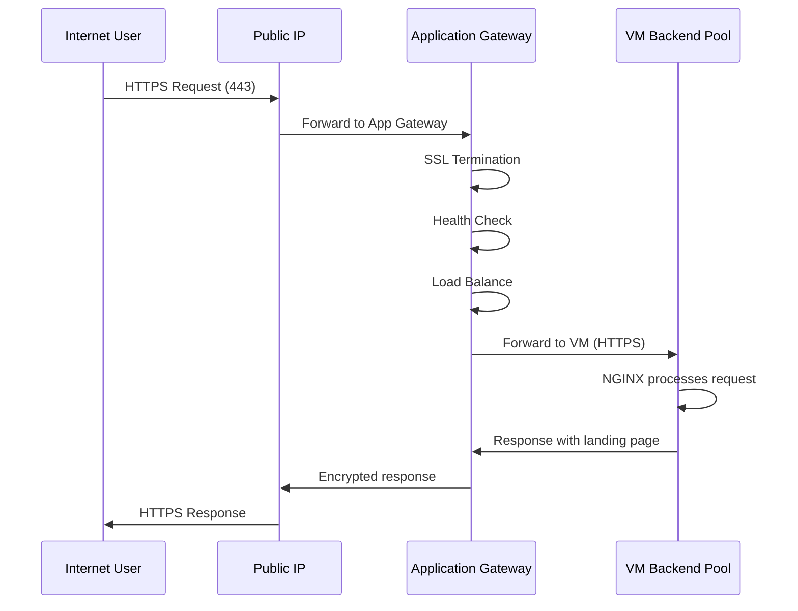
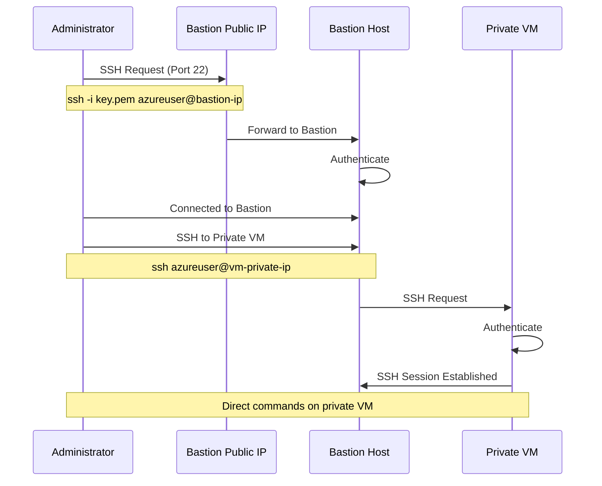
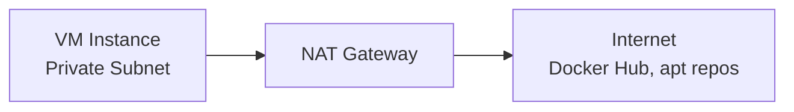
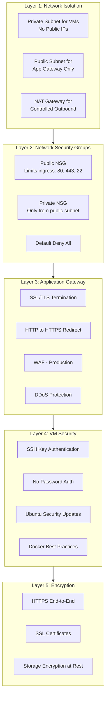
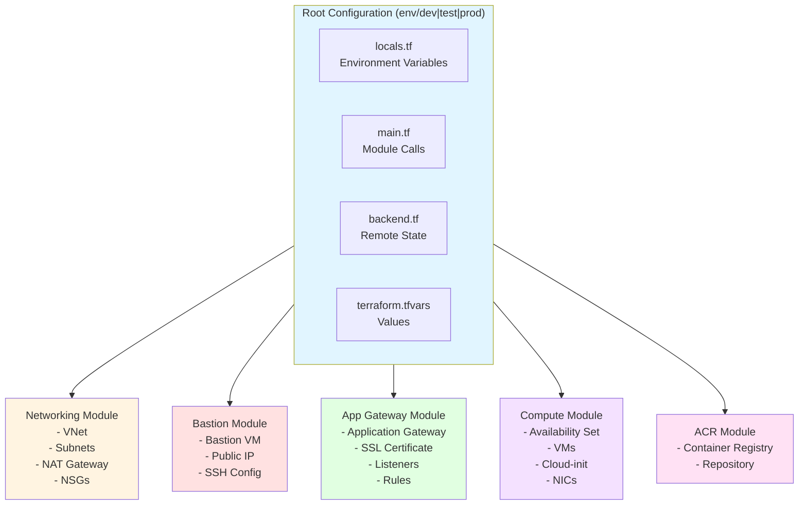
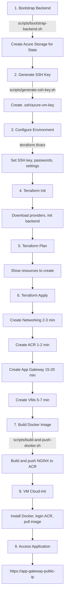

# Azure Terraform Infrastructure - Multi-Cloud NGINX Deployment


A modular, scalable, and environment-based Terraform infrastructure on Azure for deploying a Dockerized NGINX web application with HTTPS, load balancing, and Jenkins CI/CD automation.

---

## Table of Contents

- [Overview](#overview)
- [Architecture](#architecture)
  - [High-Level Architecture](#high-level-architecture)
  - [Traffic Flow](#traffic-flow)
  - [Component Details](#component-details)
  - [Security Architecture](#security-architecture)
  - [Terraform Module Architecture](#terraform-module-architecture)
- [Features](#features)
- [Project Structure](#project-structure)
- [Prerequisites](#prerequisites)
- [Quick Start](#quick-start)
- [Detailed Deployment](#detailed-deployment)
- [Environment Configuration](#environment-configuration)
- [Jenkins CI/CD](#jenkins-cicd)
- [Module Documentation](#module-documentation)
- [Contributing](#contributing)
- [Testing](#testing)
- [Troubleshooting](#troubleshooting)
- [Cost Optimization](#cost-optimization)

---

## Overview

This project provides a complete Infrastructure as Code (IaC) solution for deploying a secure, scalable web application on Azure using Terraform official registry modules.

### What's Included

- **Complete Infrastructure**: Production-ready Azure infrastructure with VMs, networking, load balancing, and container registry
- **Multi-Environment**: Separate configurations for dev (2 VMs), test (3 VMs), and production (5 VMs)
- **Security First**: HTTPS end-to-end encryption, private VM deployment, NSGs, and bastion host access
- **High Availability**: Multiple VMs deployed in Availability Sets
- **Jenkins Automation**: Complete CI/CD pipeline for automated deployment
- **Cost Optimized**: Comprehensive tagging and right-sized resources

---

## Architecture

### High-Level Architecture



### Traffic Flow

#### Request Path (HTTPS)



#### SSH Access via Bastion Host



#### Outbound Traffic



### Component Details

#### Application Gateway

- **Type**: Standard_v2 (dev/test) or WAF_v2 (production)
- **Listeners**:
  - Port 80 (HTTP) - Redirects to 443
  - Port 443 (HTTPS) - SSL Certificate
- **Backend Pool**: Connected to VM Availability Set
- **Health Probes**:
  - Path: `/health`
  - Interval: 30 seconds
  - Timeout: 30 seconds
- **Features**:
  - SSL/TLS termination
  - HTTP to HTTPS redirection
  - Cookie-based session affinity
  - Optional WAF for production

#### VM Availability Set

- **Operating System**: Ubuntu 22.04 LTS
- **Instance Count**:
  - Development: 2 VMs
  - Test: 3 VMs
  - Production: 5 VMs
- **Software**: Docker CE pre-installed
- **Container**: NGINX from Azure Container Registry
- **Deployment**: Cloud-init pulls Docker image on boot
- **High Availability**: Deployed across fault and update domains

#### Bastion Host

- **Purpose**: Secure SSH gateway to private VMs
- **Location**: Public subnet (alongside Application Gateway)
- **VM Size**: Standard_B1s (cost-effective)
- **Operating System**: Ubuntu 22.04 LTS
- **Public IP**: Yes (for SSH access)
- **Authentication**: SSH key only (no password authentication)
- **Features**:
  - Jump server for private VM access
  - Controlled access with allowed CIDR configuration
  - Audit logging for security compliance

#### Network Security

**Public Network Security Group**:
- Allows port 80, 443 (web traffic)
- Allows port 65200-65535 (Application Gateway management)
- Allows port 22 (SSH to bastion from allowed CIDR)
- Denies all other inbound traffic

**Private Network Security Group**:
- Allows port 80, 443 from public subnet (Application Gateway)
- Allows port 22 from public subnet (Bastion host only)
- Denies port 22 from Internet
- Denies all other inbound traffic

**VM Network Isolation**:
- No public IPs on application VMs
- All VMs in private subnet
- Internet access only through NAT Gateway (outbound)

#### Azure Container Registry

- **Development/Test**: Standard tier
- **Production**: Standard tier (Premium optional for geo-replication)
- **Access**: Admin enabled for VM pull authentication
- **Repository**: nginx-https
- **Tags**: Environment-based (latest, dev, test, prod)

### Security Architecture



### Terraform Module Architecture



### Deployment Flow



---

## Features

### Infrastructure
- Modular Terraform architecture using official Azure provider
- Multi-environment deployment (dev, test, prod)
- Private network deployment for security
- Availability Sets for high availability
- Application Gateway for Layer 7 load balancing
- Fixed VM count per environment (no auto-scaling)

### Security
- End-to-end HTTPS encryption
- VMs deployed in private subnet (not internet-accessible)
- Bastion host for secure SSH access
- Network Security Groups with restrictive rules
- SSH key-based authentication (bastion)
- Self-signed SSL certificates (replaceable with custom certificates)
- HTTP to HTTPS automatic redirection

### Automation
- Jenkins pipeline for CI/CD
- Automated backend state management
- Docker image build and push scripts
- Cloud-init for VM provisioning

---

## Project Structure

```
azure_terraform_infrastructure_optimization/
├── docker/
│   └── nginx/                 # NGINX Docker configuration
│       ├── Dockerfile
│       ├── nginx.conf
│       ├── default.conf
│       └── index.html
├── env/
│   ├── dev/                   # Development (2 VMs)
│   ├── test/                  # Test (3 VMs)
│   └── prod/                  # Production (3 VMs)
│       ├── backend.tf         # Remote state config
│       ├── variables.tf       # Variable definitions
│       ├── terraform.tfvars   # Variable values (EDIT THIS!)
│       ├── locals.tf          # Computed values
│       ├── main.tf            # Module instantiation
│       └── outputs.tf         # Output values
├── modules/
│   ├── networking/            # VNet, subnets, NSGs, NAT Gateway
│   ├── bastion/               # Bastion host (jump server)
│   ├── compute/               # Virtual Machines with Availability Set
│   ├── app-gateway/           # Application Gateway with HTTPS
│   └── acr/                   # Azure Container Registry
├── scripts/
│   ├── bootstrap-backend.sh   # Create Terraform backend
│   └── build-and-push-docker.sh # Build and push Docker image
├── Jenkinsfile                # Jenkins CI/CD pipeline
└── README.md                  # This file
```

---

## Prerequisites

### Required Tools

1. **Azure CLI** (2.50+)
   ```bash
   curl -sL https://aka.ms/InstallAzureCLIDeb | sudo bash
   ```

2. **Terraform** (1.5+)
   ```bash
   wget https://releases.hashicorp.com/terraform/1.5.7/terraform_1.5.7_linux_amd64.zip
   unzip terraform_1.5.7_linux_amd64.zip
   sudo mv terraform /usr/local/bin/
   ```

3. **Docker** (for building images)
   ```bash
   curl -fsSL https://get.docker.com -o get-docker.sh
   sudo sh get-docker.sh
   ```

### Azure Requirements

- Active Azure subscription
- Permissions to create resources
- Service Principal for CI/CD (optional)

### Create Azure Service Principal

```bash
az login
az account set --subscription "YOUR_SUBSCRIPTION_ID"

az ad sp create-for-rbac \
  --name "terraform-sp" \
  --role="Contributor" \
  --scopes="/subscriptions/YOUR_SUBSCRIPTION_ID"
```

Save the output - you'll need it for Jenkins.

---

## Quick Start

Get up and running in 10 minutes!

### 1. Clone Repository

```bash
git clone https://github.com/yourusername/azure_terraform_infrastructure_optimization.git
cd azure_terraform_infrastructure_optimization
chmod +x scripts/*.sh
```

### 2. Verify Prerequisites

```bash
# Check Azure CLI
az --version

# Check Terraform
terraform version

# Login to Azure
az login
az account show
```

### 3. Bootstrap Backend

```bash
./scripts/bootstrap-backend.sh
```

**Purpose**: Creates Azure Storage Account (`tfstateazuresa`) for Terraform state management.

### 4. Configure Environment

```bash
cd env/dev
nano terraform.tfvars
```

**All configuration is in `terraform.tfvars`**:
```hcl
# Security
admin_password = "YourSecurePassword123!"

# Bastion Host SSH Access 🆕
ssh_public_key   = "ssh-rsa AAAAB3NzaC1yc2EAAAADAQABAAABAQC..."  # Your SSH public key
allowed_ssh_cidr = "*"  # Restrict to your IP: "203.0.113.1/32"

# Project settings (customize as needed)
project_name = "webapp"
location     = "eastasia"

# Infrastructure settings (pre-configured, modify if needed)
vm_sku         = "Standard_B2s"
instance_count = 2
# ... and more
```

**Password Requirements** (for VMs):
- 12-72 characters
- Must include uppercase, lowercase, number, and special character

**SSH Public Key** (for Bastion):
- Generate key: `ssh-keygen -t rsa -b 4096 -f ~/.ssh/azure_key`
- Copy public key: `cat ~/.ssh/azure_key.pub`
- Paste into `ssh_public_key` variable

### 5. Deploy Infrastructure

```bash
terraform init
terraform plan
terraform apply
```

**Note**: Deployment takes approximately 5-10 minutes for completion

### 6. Build Docker Image

```bash
./scripts/build-and-push-docker.sh dev
```

This builds the NGINX container and pushes it to Azure Container Registry.

### 7. Access Application

```bash
cd env/dev
APP_IP=$(terraform output -raw app_gateway_public_ip)
echo "https://$APP_IP"
```

Visit the URL in your browser (accept self-signed certificate warning).

---

## Detailed Deployment

### Step 1: Azure Login

```bash
az login
az account show
```

Verify you're in the correct subscription.

### Step 2: Initialize Backend

```bash
./scripts/bootstrap-backend.sh
```

This creates:
- Resource Group: `tfstate-rg`
- Storage Account: `tfstateazuresa`
- Container: `tfstate`

### Step 3: Configure Environment

```bash
cd env/dev
nano terraform.tfvars
```

Edit `terraform.tfvars`:
```hcl
admin_password = "YourSecurePassword123!"
```

**Password Requirements**:
- Minimum 12 characters, maximum 72
- Must contain uppercase letter
- Must contain lowercase letter
- Must contain number
- Must contain special character

### Step 4: Deploy Infrastructure

```bash
cd env/dev
terraform init
terraform validate
terraform plan -out=tfplan
terraform apply tfplan
```

### Step 5: Build Docker Image

```bash
./scripts/build-and-push-docker.sh dev latest
```

This will:
1. Build the NGINX Docker image
2. Tag it with `latest` and environment
3. Push to Azure Container Registry
4. Display the image URL

### Step 6: Verify Deployment

```bash
cd env/dev
terraform output
```

Test the application:
```bash
APP_IP=$(terraform output -raw app_gateway_public_ip)

# Test HTTP (redirects to HTTPS)
curl -I http://$APP_IP

# Test HTTPS
curl -k https://$APP_IP

# Test health endpoint
curl -k https://$APP_IP/health
```

### Step 7: Monitor VMs

```bash
# Get resource group
RG_NAME=$(terraform output -json resource_group_names | jq -r '.compute')

# List VMs
az vm list --resource-group $RG_NAME --output table

# Check VM status
az vm get-instance-view \
  --resource-group $RG_NAME \
  --name dev-multicloud-vm-0 \
  --query "instanceView.statuses[1]" \
  --output table
```

---

## Environment Configuration

### Dev Environment
- **Location**: East Asia
- **VM SKU**: Standard_B2s
- **VM Count**: 2
- **ACR**: Standard tier
- **Purpose**: Development and testing

### Test Environment
- **Location**: East Asia
- **VM SKU**: Standard_B2ms
- **VM Count**: 3
- **ACR**: Standard tier
- **Purpose**: Pre-production validation

### Production Environment
- **Location**: East Asia
- **VM SKU**: Standard_B2s
- **VM Count**: 3
- **ACR**: Standard tier
- **App Gateway**: Standard_v2
- **Purpose**: Production workloads

Each environment has independent:
- Terraform state files
- Resource groups
- Network CIDR ranges
- VM sizing and count
- Tag values

---

## Jenkins CI/CD

### Pipeline Overview

The Jenkinsfile provides automated deployment with:
- Environment selection (dev/test/prod)
- Action choice (plan/apply/destroy)
- Optional Docker image build
- Approval gates for apply/destroy actions
- VM restart after image update

### Setup Jenkins

#### 1. Install Plugins

- Azure CLI Plugin
- Pipeline Plugin
- Docker Pipeline Plugin
- Git Plugin

#### 2. Configure Credentials

Add Azure Service Principal as Jenkins credentials:
- ID: `azure-sp`
- Type: Secret text or Username with password
- Values from `az ad sp create-for-rbac` output

#### 3. Create Pipeline Job

1. New Item → Pipeline
2. Configure:
   - **Pipeline from SCM**: Git
   - **Repository URL**: Your GitHub repo URL
   - **Script Path**: `Jenkinsfile`
3. Save

#### 4. Run Pipeline

1. Click "Build with Parameters"
2. Select:
   - **ENVIRONMENT**: `dev`, `test`, or `prod`
   - **ACTION**: `plan`, `apply`, or `destroy`
   - **BUILD_DOCKER**: Check to build Docker image
3. Click "Build"
4. Approve when prompted (for apply/destroy)

### Pipeline Stages

1. **Checkout**: Clone repository
2. **Setup Terraform**: Install Terraform binary
3. **Azure Login**: Authenticate using service principal
4. **Terraform Init**: Initialize backend and providers
5. **Terraform Validate**: Validate configuration syntax
6. **Terraform Plan**: Generate execution plan
7. **Approval** (for apply): Manual approval gate
8. **Terraform Apply**: Deploy infrastructure
9. **Build Docker** (optional): Build and push NGINX image
10. **Restart VMs** (optional): Restart VMs to pull new image
11. **Terraform Destroy** (for destroy): Remove infrastructure

### Environment Variables

Set these in Jenkins credentials or pipeline:

```groovy
environment {
    ARM_CLIENT_ID       = credentials('azure-client-id')
    ARM_CLIENT_SECRET   = credentials('azure-client-secret')
    ARM_SUBSCRIPTION_ID = credentials('azure-subscription-id')
    ARM_TENANT_ID       = credentials('azure-tenant-id')
}
```

---

## Module Documentation

### Networking Module

Creates the network foundation for all environments.

**Path**: `modules/networking/`

**Resources**:
- Virtual Network
- Public subnet (for Application Gateway)
- Private subnet (for VMs)
- NAT Gateway with Public IP
- Application Gateway Public IP
- Network Security Groups (NSGs)

**Key Variables**:
```hcl
vnet_address_space   = "10.0.0.0/16"
public_subnet_cidr   = "10.0.1.0/24"
private_subnet_cidr  = "10.0.2.0/24"
```

**Outputs**:
- `vnet_id` - Virtual Network ID
- `public_subnet_id` - Public subnet ID
- `private_subnet_id` - Private subnet ID
- `app_gateway_public_ip_id` - App Gateway public IP ID

### Compute Module

Deploys Virtual Machines in Availability Set.

**Path**: `modules/compute/`

**Resources**:
- Availability Set
- Network Interfaces (one per VM)
- Linux Virtual Machines (Ubuntu 20.04)
- Cloud-init configuration
- Backend pool associations

**Key Variables**:
```hcl
vm_sku         = "Standard_B2s"
instance_count = 2
admin_username = "azureuser"
admin_password = "YourSecurePassword123!"
```

**Features**:
- Fixed VM count (no auto-scaling)
- Docker pre-installed via cloud-init
- Automatic container deployment from ACR
- Health probe integration

**Outputs**:
- `vm_ids` - List of VM IDs
- `vm_names` - List of VM names
- `vm_private_ips` - List of private IP addresses
- `availability_set_id` - Availability Set ID

### Application Gateway Module

Provides HTTPS load balancing with optional WAF.

**Path**: `modules/app-gateway/`

**Resources**:
- Application Gateway (Standard_v2 or WAF_v2)
- SSL certificate (self-signed)
- Backend pools
- HTTP listener (redirects to HTTPS)
- HTTPS listener
- Routing rules
- Health probes (HTTP and HTTPS)

**Key Variables**:
```hcl
sku_name     = "Standard_v2"  # or WAF_v2
sku_tier     = "Standard_v2"  # or WAF_v2
capacity     = 2
enable_http2 = true
```

**Features**:
- End-to-end HTTPS encryption
- HTTP to HTTPS automatic redirection
- Backend health monitoring
- Cookie-based session affinity
- Optional Web Application Firewall (WAF) for production

**Outputs**:
- `app_gateway_id` - Application Gateway ID
- `app_gateway_public_ip` - Public IP address
- `backend_address_pool_id` - Backend pool ID

### ACR Module

Container image storage and management.

**Path**: `modules/acr/`

**Resources**:
- Azure Container Registry
- Admin access credentials
- Network rules
- Optional geo-replication (Premium tier)

**Key Variables**:
```hcl
sku                = "Standard"  # Basic, Standard, or Premium
admin_enabled      = true
georeplication_locations = []  # For Premium tier
```

**Tiers**:
- **Basic**: Development and testing
- **Standard**: General purpose, sufficient for most workloads
- **Premium**: Production with geo-replication and advanced features

**Outputs**:
- `acr_id` - Container Registry ID
- `acr_name` - Container Registry name
- `acr_login_server` - Login server URL
- `acr_admin_username` - Admin username
- `acr_admin_password` - Admin password (sensitive)

---

## Contributing

Contributions are welcome! Please follow these guidelines:

### Reporting Issues

Create detailed issue reports with:
- Clear description of the problem
- Steps to reproduce
- Expected vs actual behavior
- Environment details (OS, Terraform version, Azure CLI version)
- Relevant error logs

**Template**:
```markdown
## Description
[Clear description]

## Steps to Reproduce
1. Step one
2. Step two

## Expected Behavior
[What should happen]

## Actual Behavior
[What actually happens]

## Environment
- OS: Ubuntu 22.04
- Terraform: 1.5.7
- Azure CLI: 2.50.0

## Logs
[Error messages or logs]
```

### Suggesting Enhancements

Enhancement suggestions should include:
- **Use case**: Why this would be useful
- **Description**: Clear explanation of the enhancement
- **Examples**: How it would work
- **Alternatives**: Other solutions considered

### Pull Requests

1. Fork the repository
2. Create a feature branch: `git checkout -b feature/your-feature-name`
3. Make your changes
4. Test thoroughly in dev environment
5. Commit with conventional commits format
6. Submit pull request with clear description

### Commit Convention

Use conventional commits format:

```
<type>(<scope>): <subject>
```

**Types**:
- `feat:` New feature
- `fix:` Bug fix
- `docs:` Documentation changes
- `style:` Code style (formatting, no functional change)
- `refactor:` Code refactoring
- `test:` Adding or updating tests
- `chore:` Maintenance tasks

**Examples**:
```bash
feat(compute): add support for custom VM images
fix(networking): correct NSG rule for HTTPS
docs(readme): update quick start guide
refactor(modules): simplify variable declarations
```

### Coding Standards

#### Terraform

- Use meaningful resource names
- Follow naming convention: `<environment>-<project>-<resource>-<type>`
- Add comments for complex logic
- Use variables for all configurable values
- Always include descriptions for variables and outputs

**Example**:
```hcl
variable "instance_count" {
  description = "Number of VM instances to deploy"
  type        = number
  default     = 2
  
  validation {
    condition     = var.instance_count > 0 && var.instance_count <= 100
    error_message = "Instance count must be between 1 and 100."
  }
}
```

#### Formatting

```bash
# Format Terraform files
terraform fmt -recursive

# Validate configuration
terraform validate

# Run before committing
cd env/dev
terraform init
terraform validate
```

### Code of Conduct

- Be respectful and considerate
- Accept constructive criticism gracefully
- Focus on what's best for the community
- Show empathy towards others

---

## Testing

### Before Submitting Changes

1. **Format Code**:
   ```bash
   terraform fmt -recursive
   ```

2. **Validate Configuration**:
   ```bash
   cd env/dev
   terraform init
   terraform validate
   ```

3. **Test in Dev**:
   ```bash
   ./scripts/deploy.sh dev apply
   ```

4. **Verify Application**:
   ```bash
   cd env/dev
   APP_IP=$(terraform output -raw app_gateway_public_ip)
   curl -k https://$APP_IP
   ```

5. **Clean Up**:
   ```bash
   ./scripts/deploy.sh dev destroy
   ```

### Manual Testing Checklist

- [ ] Terraform fmt completes without changes
- [ ] Terraform validate passes
- [ ] Terraform plan shows expected changes
- [ ] Resources deploy successfully
- [ ] Application is accessible via HTTPS
- [ ] HTTP redirects to HTTPS
- [ ] Health endpoint responds
- [ ] VMs are in private subnet
- [ ] Application Gateway health checks pass
- [ ] Docker containers are running
- [ ] No sensitive data in logs

---

## Troubleshooting

### Common Issues

#### Backend Initialization Failed

**Error**: "Error acquiring the state lock"

**Solution**:
```bash
cd env/dev
terraform force-unlock LOCK_ID
```

Replace `LOCK_ID` with the ID from the error message.

#### Cannot Access HTTPS Site

**Symptoms**: Connection timeout or refused

**Checks**:
1. Verify Application Gateway health:
   ```bash
   az network application-gateway show-backend-health \
     --name APPGW_NAME \
     --resource-group RG_NAME
   ```

2. Check NSG rules:
   ```bash
   az network nsg rule list \
     --nsg-name NSG_NAME \
     --resource-group RG_NAME \
     --output table
   ```

3. Verify VMs are running:
   ```bash
   az vm list \
     --resource-group RG_NAME \
     --output table
   ```

4. Check Application Gateway public IP:
   ```bash
   cd env/dev
   terraform output app_gateway_public_ip
   ```

#### VMs Not Healthy in Backend Pool

**Symptoms**: Application Gateway shows unhealthy backends

**Solutions**:

1. Check Docker container status:
   ```bash
   # Connect to VM (requires Azure Bastion or VPN)
   docker ps
   docker logs <container_id>
   ```

2. Verify health probe path:
   ```bash
   # From within the VNet or via VPN
   curl http://VM_PRIVATE_IP/health
   ```

3. Check NSG allows health probes:
   - Health probes come from `168.63.129.16`
   - Ensure NSG allows traffic from this IP

#### SSH Access to Private VMs

**Solution**: Use the built-in Bastion Host (jump server)

**Step 1: Get Bastion Public IP**
```bash
cd env/dev
terraform output bastion_public_ip
# or
terraform output bastion_ssh_command
```

**Step 2: SSH to Bastion Host**
```bash
# Replace with your SSH key path and bastion IP
ssh -i ~/.ssh/id_rsa azureuser@<bastion-public-ip>
```

**Step 3: From Bastion, SSH to Private VM**
```bash
# Get private VM IPs
terraform output vm_private_ips

# SSH to private VM (password: from terraform.tfvars)
ssh azureuser@<vm-private-ip>
```

**Alternative: Direct SSH with Jump**
```bash
# SSH directly to private VM through bastion
ssh -J azureuser@<bastion-ip> azureuser@<vm-private-ip>
```

**Configure SSH Key (Recommended)**
```bash
# Copy your SSH public key to terraform.tfvars
ssh_public_key = "ssh-rsa AAAAB3NzaC1yc2EAAAADAQABAAABAQC..."

# Restrict SSH access to your IP
allowed_ssh_cidr = "203.0.113.1/32"  # Replace with your public IP
```

#### Docker Image Pull Failed

**Symptoms**: VMs cannot pull image from ACR

**Solutions**:

1. Verify ACR credentials:
   ```bash
   cd env/dev
   terraform output acr_admin_username
   terraform output acr_admin_password
   ```

2. Test ACR login manually:
   ```bash
   az acr login --name YOUR_ACR_NAME
   ```

3. Check cloud-init logs on VM:
   ```bash
   # Connect to VM (requires Azure Bastion or VPN)
   sudo cat /var/log/cloud-init-output.log
   ```

4. Verify image exists:
   ```bash
   az acr repository list --name YOUR_ACR_NAME
   az acr repository show-tags \
     --name YOUR_ACR_NAME \
     --repository nginx-app
   ```

#### Terraform Apply Fails

**Error**: Various errors during apply

**General Steps**:

1. **Check Terraform version**:
   ```bash
   terraform version
   ```

2. **Reinitialize**:
   ```bash
   cd env/dev
   rm -rf .terraform
   terraform init
   ```

3. **Enable debug logging**:
   ```bash
   export TF_LOG=DEBUG
   terraform apply
   ```

4. **Check Azure CLI authentication**:
   ```bash
   az account show
   ```

5. **Verify quotas**:
   ```bash
   az vm list-usage --location eastus --output table
   ```

### Debug Commands

```bash
# Terraform debug logging
export TF_LOG=DEBUG
export TF_LOG_PATH=./terraform.log
terraform apply

# Azure CLI debug
az account show --debug

# Check VM status
az vm get-instance-view \
  --name VM_NAME \
  --resource-group RG_NAME \
  --query "instanceView.statuses"

# Check Application Gateway
az network application-gateway show \
  --name APPGW_NAME \
  --resource-group RG_NAME

# List all resources in RG
az resource list \
  --resource-group RG_NAME \
  --output table

# Check Activity Log for errors
az monitor activity-log list \
  --resource-group RG_NAME \
  --status Failed \
  --max-events 10
```

---

## Cost Optimization

### Estimated Monthly Costs

| Environment | VM Count | VM SKU | Storage | App GW | ACR | Total Est. |
|-------------|----------|--------|---------|--------|-----|------------|
| Dev | 2 | Standard_B2s | Standard SSD | Standard_v2 | Standard | ~$195/mo |
| Test | 3 | Standard_B2ms | Standard SSD | Standard_v2 | Standard | ~$245/mo |
| Prod | 3 | Standard_B2s | Standard SSD | Standard_v2 | Standard | ~$230/mo |

*Costs are approximate and vary by region. See [Azure Pricing Calculator](https://azure.microsoft.com/pricing/calculator/).*

### Cost Breakdown (Dev Environment)

- **VMs (2x Standard_B2s)**: ~$35/month each = $70
- **Premium SSD (128GB)**: ~$20/month
- **Application Gateway (Standard_v2)**: ~$125/month
- **ACR (Standard)**: ~$20/month
- **Networking (NAT, Public IPs)**: ~$10/month
- **Storage Account (Terraform state)**: ~$1/month

### Cost Reduction Tips

1. **Use Reserved Instances**
   - Save up to 72% on VMs
   - 1 or 3-year commitments available
   ```bash
   # Calculate savings
   az reservations calculate-purchase-price
   ```

2. **Right-size VMs**
   - Monitor CPU/memory usage in Azure Monitor
   - Downsize underutilized VMs
   ```bash
   # Get VM sizes in region
   az vm list-sizes --location eastus --output table
   ```

3. **Schedule Shutdowns**
   ```bash
   # Deallocate VMs during off-hours
   az vm deallocate --name VM_NAME --resource-group RG_NAME
   
   # Start VMs
   az vm start --name VM_NAME --resource-group RG_NAME
   ```

4. **Use Dev/Test Pricing**
   - If eligible, use Dev/Test subscription
   - Significantly lower rates for non-production

5. **Clean Up Unused Resources**
   ```bash
   # Destroy environment when not needed
   ./scripts/deploy.sh dev destroy
   ```

6. **Optimize Storage**
   - Use Standard SSD instead of Premium for non-prod
   - Enable soft delete with shorter retention

7. **Use Tags for Cost Analysis**
   - All resources are tagged with:
     - `Environment`
     - `Project`
     - `ManagedBy`
   - Use Azure Cost Management to track by tags

8. **Application Gateway Optimization**
   - Scale down capacity during off-hours
   - Use Standard_v2 instead of WAF_v2 for non-prod

### Monitoring Costs

```bash
# View cost by resource group
az consumption usage list \
  --start-date 2024-01-01 \
  --end-date 2024-01-31
```

---

## Acknowledgments

- [Azure Terraform Provider](https://registry.terraform.io/providers/hashicorp/azurerm/latest)
- [HashiCorp Terraform Best Practices](https://www.terraform.io/docs/cloud/guides/recommended-practices/index.html)
- [Azure Architecture Center](https://docs.microsoft.com/azure/architecture/)
- Community contributors and testers


---

*Last Updated: 7 October 2025*  
